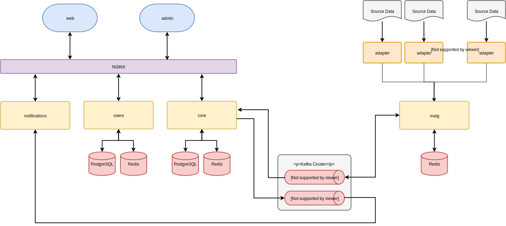

# Service Map

## Welcome!

The Yacs project consists of a number of services. Each of the core services lives in a top-level directory in the Yacs repo.
In this document you will find a description of each service, how that service is built, and what that service is responsible for.
More detailed information about a service can be found in it's respective  `README.md`.
This is a good place to start if you don't know where something lives, or want to learn more about the structure of the application in general.

## Services

The above diagram shows how each of the services connect.
For more in-depth information on how Yacs operates as a whole, see [overview](architecture/overview)

### [core](https://github.com/yacs-rcos/yacs/blob/master/core)

Yacs is currently the largest service.
To avoid confusion, we'll call this "Yacs Core", or just "Core".
Yacs Core permanantly stores all of the data pertaining to sessions, schools, departments, subjects, courses, listings, sections, and professors.
It provides a REST API for accessing and manually updating this data.
Yacs Core is also responsible for generating schedules, and computing section conflicts.
It is a Rails 5 app, and uses PostgreSQL to store data.

### [web](https://github.com/yacs-rcos/yacs/blob/master/web)

Yacs Web is the primary student-facing frontend for Yacs.
It is written in Typescript with Angular 6.
When you go to use Yacs, this is what you see.
It provides the interface for browsing, searching, and selecting courses, as well as viewing schedules.
It will also provide an interface for receiving notifications (planned).
If you are a new contributor, this is probably the best place to look for work to do as well.

### [admin](https://github.com/yacs-rcos/yacs-admin)

Yacs Admin is the administrative frontend for Yacs.
It is an interface for administrators, instructors, and sysadmins to make manual updates to the Yacs database.
In practice, it is typically used for correcting errors, updating course details, and managing non-catalog (special topics) courses.

### [malg](https://github.com/yacs-rcos/yacs/blob/master/malg)

Yacs Malg is the 'secret sauce' that connects Yacs to your university.
It pulls data from JSON data sources, and intelligently and configurably combines (amalgamates) it into a master graph.
The graph serialized and stored in Redis for internal persistance, and every entity is written to a Kafka topic as well for further processing and storage.
Malg polls each data source at regular intervals, and continually writes changes to Redis and Kafka.

### [adapters](https://github.com/yacs-rcos/yacs/blob/master/adapters)

Yacs uses services called adapters to pull data from a university's systems, and transform that data into a form Yacs can ingest.
Each data source has a corresponding adapter, which, when combined, provide a complete picture of a university's academic data.
It is very easy to create new adapters - more information explaining them can be found on the [adapters documentation](https://yacs.io/#/architecture/adapters).
They can be written in any language, and must simply respond to a set of http endpoints.

### [users](https://github.com/yacs-rcos/yacs/blob/master/users)

Yacs Users is the user authentication server for Yacs.
It is a full stack Rails 5 app, and uses devise for authentication.
It also handles storing user data, and provides a REST API for accessing and modifying that data (planned).

### [notifications](https://github.com/yacs-rcos/yacs/blob/master/notifications)

Yacs Notifications serves the streaming API for changes to Yacs objects.
It allows clients to receive notifications regarding courses and sections they are interested in.

### [docs](https://github.com/yacs-rcos/docs)

Docs is the repository for this documentation!
It uses Docsify, and awesome static site generator that generates beautiful documentation from everyday Markdown files.
Because we have a bunch of repos, documentation goes in here so it is easier to find, with the exception of each service's README.

### [nginx](https://github.com/yacs-rcos/yacs-nginx)

The nginx configuration we use to deploy Yacs.
It has reverse proxies for the external APIs and services the frontend builds.

### [auth](https://github.com/yacs-rcos/yacs-auth)

Yacs Auth is a microservice authorization library.
It contains our authorization logic and session management, which uses JSON Web Tokens (JWT) with Redis for session handling and validation.
This library allows any service to authenticate a user and validate or invalidate their session, as long as that service is connected to the shared Redis instance.
